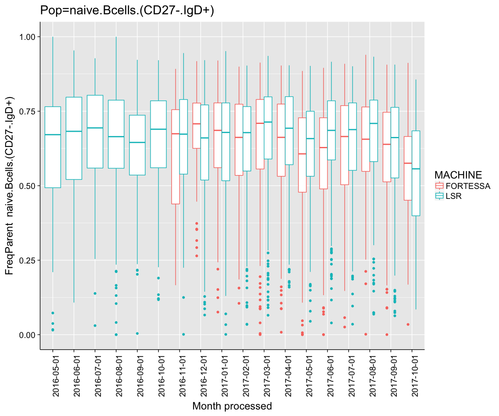
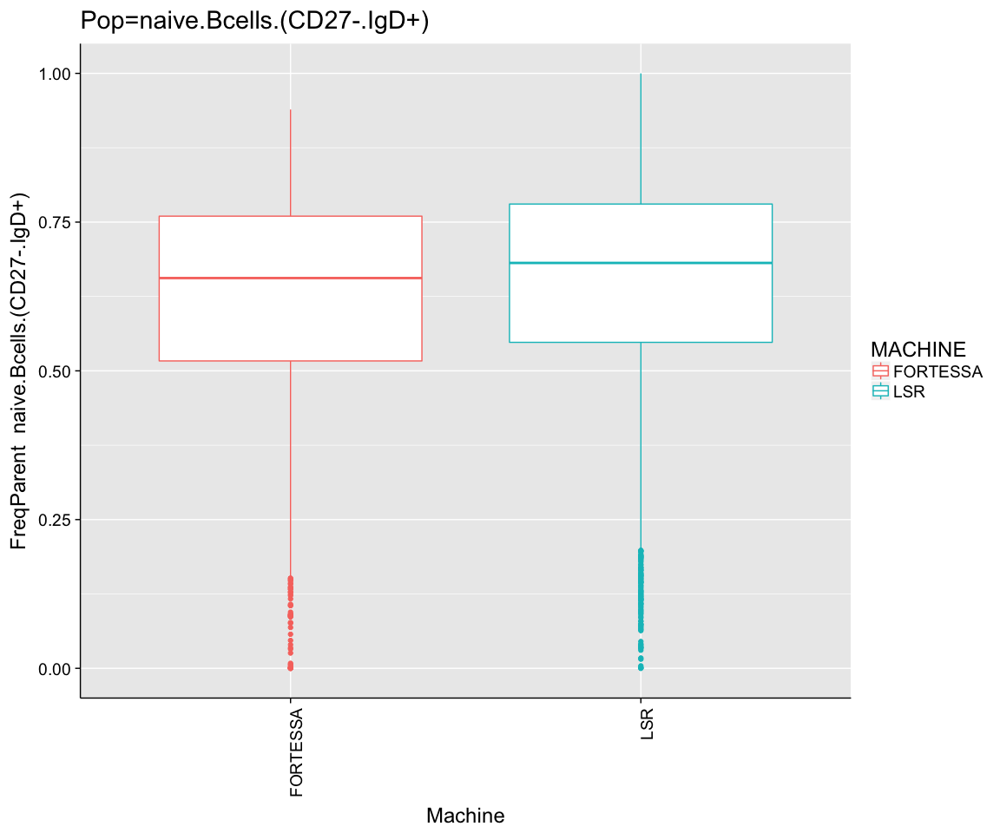
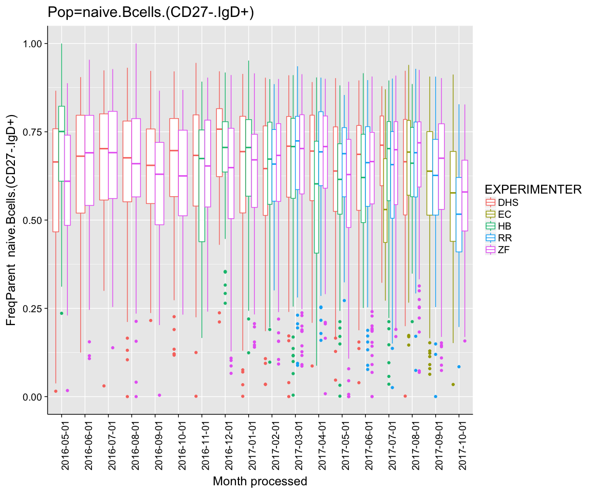
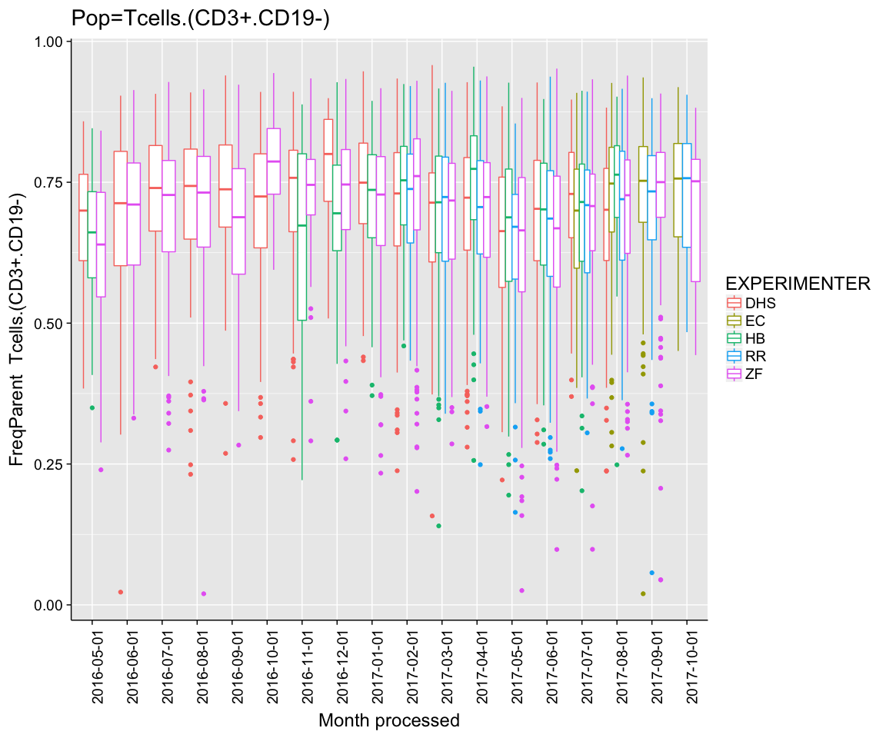

# TrendQC for Populations
JL  
1/16/2018  


# Trends by population

- removed samples that did not match to a Lab ID from the "FLOW ONLY" tab of "HRS sample list.xlsx"
- removed samples where date could not be parsed
- removed samples where EXPERIMENTER could not be parsed
- removed samples that were manually gated


```
## [1] "# Start of new population results"
## [1] "naive.Bcells.(CD27-.IgD+)"
## [1] "n=9079"
## [1] "PLOT TYPE = Machine Time COUNT OC"
```

<!-- --><!-- --><!-- -->

```
## 
## 	Pearson's product-moment correlation
## 
## data:  merge[, colC] and merge[, coljflowCount]
## t = 47.188, df = 904, p-value < 2.2e-16
## alternative hypothesis: true correlation is not equal to 0
## 95 percent confidence interval:
##  0.8234567 0.8611838
## sample estimates:
##       cor 
## 0.8433564 
## 
## 
## 	Spearman's rank correlation rho
## 
## data:  merge[, colC] and merge[, coljflowCount]
## S = 9635500, p-value < 2.2e-16
## alternative hypothesis: true rho is not equal to 0
## sample estimates:
##       rho 
## 0.9222605
```

<!-- -->

```
## [1] "naive.Bcells.(CD27-.IgD+)"
## [1] "n=9079"
## [1] "PLOT TYPE = Machine Time FREQ"
```

<!-- --><!-- --><!-- --><!-- -->

```
## 
## 
## |Var1 |Var2     | Freq|
## |:----|:--------|----:|
## |DHS  |FORTESSA |  703|
## |EC   |FORTESSA |  360|
## |HB   |FORTESSA |  848|
## |RR   |FORTESSA |  539|
## |ZF   |FORTESSA |  998|
## |DHS  |LSR      | 1520|
## |EC   |LSR      |  407|
## |HB   |LSR      |  489|
## |RR   |LSR      |  731|
## |ZF   |LSR      | 2484|
## [1] "Linear Regression for naive.Bcells.(CD27-.IgD+)"
## 
## Call:
## lm(formula = formula, data = subF)
## 
## Residuals:
##      Min       1Q   Median       3Q      Max 
## -0.65152 -0.10020  0.03273  0.13220  0.35104 
## 
## Coefficients:
##                  Estimate Std. Error t value Pr(>|t|)    
## (Intercept)     9.842e-01  2.905e-01   3.387 0.000709 ***
## DATE_MONTH     -2.065e-05  1.687e-05  -1.224 0.221012    
## MACHINELSR      2.174e-02  3.998e-03   5.438 5.52e-08 ***
## EXPERIMENTEREC -1.382e-02  8.118e-03  -1.702 0.088708 .  
## EXPERIMENTERHB  7.465e-03  6.120e-03   1.220 0.222628    
## EXPERIMENTERRR  8.604e-03  6.465e-03   1.331 0.183286    
## EXPERIMENTERZF -5.590e-03  4.725e-03  -1.183 0.236839    
## ---
## Signif. codes:  0 '***' 0.001 '**' 0.01 '*' 0.05 '.' 0.1 ' ' 1
## 
## Residual standard error: 0.1722 on 9072 degrees of freedom
## Multiple R-squared:  0.005491,	Adjusted R-squared:  0.004833 
## F-statistic: 8.348 on 6 and 9072 DF,  p-value: 4.782e-09
## 
## [1] "Stepwise Linear Regression for naive.Bcells.(CD27-.IgD+)"
## Start:  AIC=-31934.79
## TARGET_FREQ ~ DATE_MONTH + MACHINE + EXPERIMENTER
## 
##                Df Sum of Sq    RSS    AIC
## - DATE_MONTH    1   0.04442 269.05 -31935
## <none>                      269.01 -31935
## - EXPERIMENTER  4   0.40324 269.41 -31929
## - MACHINE       1   0.87701 269.89 -31907
## 
## Step:  AIC=-31935.29
## TARGET_FREQ ~ MACHINE + EXPERIMENTER
## 
##                Df Sum of Sq    RSS    AIC
## <none>                      269.05 -31935
## + DATE_MONTH    1   0.04442 269.01 -31935
## - EXPERIMENTER  4   0.45454 269.51 -31928
## - MACHINE       1   1.06708 270.12 -31901
## Stepwise Model Path 
## Analysis of Deviance Table
## 
## Initial Model:
## TARGET_FREQ ~ DATE_MONTH + MACHINE + EXPERIMENTER
## 
## Final Model:
## TARGET_FREQ ~ MACHINE + EXPERIMENTER
## 
## 
##           Step Df   Deviance Resid. Df Resid. Dev       AIC
## 1                                 9072   269.0085 -31934.79
## 2 - DATE_MONTH  1 0.04441938      9073   269.0529 -31935.29
## [1] "ANOVA of EXPERIMENTER for naive.Bcells.(CD27-.IgD+)"
##   Tukey multiple comparisons of means
##     95% family-wise confidence level
## 
## Fit: aov(formula = formula, data = subF)
## 
## $EXPERIMENTER
##                 diff           lwr          upr     p adj
## EC-DHS -0.0218613445 -0.0415739033 -0.002148786 0.0209826
## HB-DHS -0.0006895924 -0.0169812166  0.015602032 0.9999599
## RR-DHS  0.0033880691 -0.0131697266  0.019945865 0.9809369
## ZF-DHS -0.0057381948 -0.0185178321  0.007041443 0.7367571
## HB-EC   0.0211717522 -0.0001505602  0.042494065 0.0527032
## RR-EC   0.0252494137  0.0037230441  0.046775783 0.0120229
## ZF-EC   0.0161231498 -0.0026529818  0.034899281 0.1315945
## RR-HB   0.0040776615 -0.0143673008  0.022522624 0.9746358
## ZF-HB  -0.0050486024 -0.0201937390  0.010096534 0.8933801
## ZF-RR  -0.0091262639 -0.0245573606  0.006304833 0.4886156
## 
## [1] "ANOVA of MACHINE for naive.Bcells.(CD27-.IgD+)"
##               Df Sum Sq Mean Sq F value  Pr(>F)    
## MACHINE        1   0.99  0.9863   33.22 8.5e-09 ***
## Residuals   9077 269.51  0.0297                    
## ---
## Signif. codes:  0 '***' 0.001 '**' 0.01 '*' 0.05 '.' 0.1 ' ' 1
## [1] "T-test of MACHINE for naive.Bcells.(CD27-.IgD+)"
## 
## 	Welch Two Sample t-test
## 
## data:  TARGET_FREQ by MACHINE
## t = -5.7357, df = 7174, p-value = 1.011e-08
## alternative hypothesis: true difference in means is not equal to 0
## 95 percent confidence interval:
##  -0.02881604 -0.01413616
## sample estimates:
## mean in group FORTESSA      mean in group LSR 
##              0.6274223              0.6488984 
## 
## [1] "# Start of new population results"
## [1] "cytotoxic.Tcells-CD8+"
## [1] "n=9079"
## [1] "PLOT TYPE = Machine Time COUNT OC"
```

<!-- --><!-- --><!-- -->

```
## 
## 	Pearson's product-moment correlation
## 
## data:  merge[, colC] and merge[, coljflowCount]
## t = 292.74, df = 904, p-value < 2.2e-16
## alternative hypothesis: true correlation is not equal to 0
## 95 percent confidence interval:
##  0.9940398 0.9954054
## sample estimates:
##       cor 
## 0.9947668 
## 
## 
## 	Spearman's rank correlation rho
## 
## data:  merge[, colC] and merge[, coljflowCount]
## S = 845340, p-value < 2.2e-16
## alternative hypothesis: true rho is not equal to 0
## sample estimates:
##       rho 
## 0.9931798
```

<!-- -->

```
## [1] "cytotoxic.Tcells-CD8+"
## [1] "n=9079"
## [1] "PLOT TYPE = Machine Time FREQ"
```

<!-- --><!-- --><!-- --><!-- -->

```
## 
## 
## |Var1 |Var2     | Freq|
## |:----|:--------|----:|
## |DHS  |FORTESSA |  703|
## |EC   |FORTESSA |  360|
## |HB   |FORTESSA |  848|
## |RR   |FORTESSA |  539|
## |ZF   |FORTESSA |  998|
## |DHS  |LSR      | 1520|
## |EC   |LSR      |  407|
## |HB   |LSR      |  489|
## |RR   |LSR      |  731|
## |ZF   |LSR      | 2484|
## [1] "Linear Regression for cytotoxic.Tcells-CD8+"
## 
## Call:
## lm(formula = formula, data = subF)
## 
## Residuals:
##      Min       1Q   Median       3Q      Max 
## -0.23815 -0.08556 -0.02092  0.06433  0.66971 
## 
## Coefficients:
##                  Estimate Std. Error t value Pr(>|t|)    
## (Intercept)     8.326e-01  1.991e-01   4.181 2.93e-05 ***
## DATE_MONTH     -3.412e-05  1.157e-05  -2.950  0.00319 ** 
## MACHINELSR     -3.366e-03  2.740e-03  -1.228  0.21938    
## EXPERIMENTEREC  3.655e-03  5.565e-03   0.657  0.51135    
## EXPERIMENTERHB  3.525e-03  4.195e-03   0.840  0.40071    
## EXPERIMENTERRR  5.824e-03  4.431e-03   1.314  0.18876    
## EXPERIMENTERZF  8.566e-03  3.239e-03   2.645  0.00819 ** 
## ---
## Signif. codes:  0 '***' 0.001 '**' 0.01 '*' 0.05 '.' 0.1 ' ' 1
## 
## Residual standard error: 0.118 on 9072 degrees of freedom
## Multiple R-squared:  0.001903,	Adjusted R-squared:  0.001243 
## F-statistic: 2.883 on 6 and 9072 DF,  p-value: 0.008288
## 
## [1] "Stepwise Linear Regression for cytotoxic.Tcells-CD8+"
## Start:  AIC=-38793.32
## TARGET_FREQ ~ DATE_MONTH + MACHINE + EXPERIMENTER
## 
##                Df Sum of Sq    RSS    AIC
## - EXPERIMENTER  4  0.103438 126.49 -38794
## - MACHINE       1  0.021017 126.40 -38794
## <none>                      126.38 -38793
## - DATE_MONTH    1  0.121241 126.50 -38787
## 
## Step:  AIC=-38793.89
## TARGET_FREQ ~ DATE_MONTH + MACHINE
## 
##                Df Sum of Sq    RSS    AIC
## - MACHINE       1  0.014264 126.50 -38795
## <none>                      126.49 -38794
## + EXPERIMENTER  4  0.103438 126.38 -38793
## - DATE_MONTH    1  0.137313 126.62 -38786
## 
## Step:  AIC=-38794.87
## TARGET_FREQ ~ DATE_MONTH
## 
##                Df Sum of Sq    RSS    AIC
## <none>                      126.50 -38795
## + MACHINE       1  0.014264 126.49 -38794
## + EXPERIMENTER  4  0.096685 126.40 -38794
## - DATE_MONTH    1  0.123285 126.62 -38788
## Stepwise Model Path 
## Analysis of Deviance Table
## 
## Initial Model:
## TARGET_FREQ ~ DATE_MONTH + MACHINE + EXPERIMENTER
## 
## Final Model:
## TARGET_FREQ ~ DATE_MONTH
## 
## 
##             Step Df   Deviance Resid. Df Resid. Dev       AIC
## 1                                   9072   126.3827 -38793.32
## 2 - EXPERIMENTER  4 0.10343758      9076   126.4861 -38793.89
## 3      - MACHINE  1 0.01426399      9077   126.5004 -38794.87
## [1] "ANOVA of EXPERIMENTER for cytotoxic.Tcells-CD8+"
##   Tukey multiple comparisons of means
##     95% family-wise confidence level
## 
## Fit: aov(formula = formula, data = subF)
## 
## $EXPERIMENTER
##                diff          lwr         upr     p adj
## EC-DHS -0.003613521 -0.017103810 0.009876769 0.9493784
## HB-DHS  0.002547180 -0.008601993 0.013696353 0.9713926
## RR-DHS  0.001456764 -0.009874563 0.012788092 0.9967606
## ZF-DHS  0.007157432 -0.001588313 0.015903177 0.1676599
## HB-EC   0.006160701 -0.008431223 0.020752626 0.7786893
## RR-EC   0.005070285 -0.009661286 0.019801856 0.8816959
## ZF-EC   0.010770953 -0.002078493 0.023620399 0.1490946
## RR-HB  -0.001090416 -0.013713226 0.011532394 0.9993187
## ZF-HB   0.004610252 -0.005754322 0.014974826 0.7435079
## ZF-RR   0.005700668 -0.004859603 0.016260939 0.5802672
## 
## [1] "ANOVA of MACHINE for cytotoxic.Tcells-CD8+"
##               Df Sum Sq  Mean Sq F value Pr(>F)
## MACHINE        1    0.0 0.000236   0.017  0.897
## Residuals   9077  126.6 0.013950               
## [1] "T-test of MACHINE for cytotoxic.Tcells-CD8+"
## 
## 	Welch Two Sample t-test
## 
## data:  TARGET_FREQ by MACHINE
## t = 0.13007, df = 7295.7, p-value = 0.8965
## alternative hypothesis: true difference in means is not equal to 0
## 95 percent confidence interval:
##  -0.004672884  0.005337083
## sample estimates:
## mean in group FORTESSA      mean in group LSR 
##              0.2476015              0.2472694 
## 
## [1] "# Start of new population results"
## [1] "Tcells.(CD3+.CD19-)"
## [1] "n=9079"
## [1] "PLOT TYPE = Machine Time COUNT OC"
```

<!-- --><!-- --><!-- -->

```
## 
## 	Pearson's product-moment correlation
## 
## data:  merge[, colC] and merge[, coljflowCount]
## t = 442.63, df = 904, p-value < 2.2e-16
## alternative hypothesis: true correlation is not equal to 0
## 95 percent confidence interval:
##  0.9973810 0.9979818
## sample estimates:
##       cor 
## 0.9977009 
## 
## 
## 	Spearman's rank correlation rho
## 
## data:  merge[, colC] and merge[, coljflowCount]
## S = 403610, p-value < 2.2e-16
## alternative hypothesis: true rho is not equal to 0
## sample estimates:
##       rho 
## 0.9967437
```

<!-- -->

```
## [1] "Tcells.(CD3+.CD19-)"
## [1] "n=9079"
## [1] "PLOT TYPE = Machine Time FREQ"
```

<!-- --><!-- --><!-- --><!-- -->

```
## 
## 
## |Var1 |Var2     | Freq|
## |:----|:--------|----:|
## |DHS  |FORTESSA |  703|
## |EC   |FORTESSA |  360|
## |HB   |FORTESSA |  848|
## |RR   |FORTESSA |  539|
## |ZF   |FORTESSA |  998|
## |DHS  |LSR      | 1520|
## |EC   |LSR      |  407|
## |HB   |LSR      |  489|
## |RR   |LSR      |  731|
## |ZF   |LSR      | 2484|
## [1] "Linear Regression for Tcells.(CD3+.CD19-)"
## 
## Call:
## lm(formula = formula, data = subF)
## 
## Residuals:
##      Min       1Q   Median       3Q      Max 
## -0.70008 -0.07236  0.02214  0.09340  0.27335 
## 
## Coefficients:
##                  Estimate Std. Error t value Pr(>|t|)    
## (Intercept)     9.126e-01  2.133e-01   4.280 1.89e-05 ***
## DATE_MONTH     -1.284e-05  1.239e-05  -1.037 0.299735    
## MACHINELSR      1.979e-02  2.934e-03   6.744 1.64e-11 ***
## EXPERIMENTEREC  3.086e-02  5.959e-03   5.180 2.27e-07 ***
## EXPERIMENTERHB  7.802e-03  4.492e-03   1.737 0.082452 .  
## EXPERIMENTERRR -1.055e-02  4.745e-03  -2.223 0.026248 *  
## EXPERIMENTERZF -1.187e-02  3.468e-03  -3.423 0.000623 ***
## ---
## Signif. codes:  0 '***' 0.001 '**' 0.01 '*' 0.05 '.' 0.1 ' ' 1
## 
## Residual standard error: 0.1264 on 9072 degrees of freedom
## Multiple R-squared:  0.0131,	Adjusted R-squared:  0.01245 
## F-statistic: 20.08 on 6 and 9072 DF,  p-value: < 2.2e-16
## 
## [1] "Stepwise Linear Regression for Tcells.(CD3+.CD19-)"
## Start:  AIC=-37551.02
## TARGET_FREQ ~ DATE_MONTH + MACHINE + EXPERIMENTER
## 
##                Df Sum of Sq    RSS    AIC
## - DATE_MONTH    1   0.01718 144.93 -37552
## <none>                      144.91 -37551
## - MACHINE       1   0.72642 145.64 -37508
## - EXPERIMENTER  4   1.29067 146.21 -37479
## 
## Step:  AIC=-37551.94
## TARGET_FREQ ~ MACHINE + EXPERIMENTER
## 
##                Df Sum of Sq    RSS    AIC
## <none>                      144.93 -37552
## + DATE_MONTH    1   0.01718 144.91 -37551
## - MACHINE       1   0.85180 145.78 -37501
## - EXPERIMENTER  4   1.28900 146.22 -37480
## Stepwise Model Path 
## Analysis of Deviance Table
## 
## Initial Model:
## TARGET_FREQ ~ DATE_MONTH + MACHINE + EXPERIMENTER
## 
## Final Model:
## TARGET_FREQ ~ MACHINE + EXPERIMENTER
## 
## 
##           Step Df   Deviance Resid. Df Resid. Dev       AIC
## 1                                 9072   144.9150 -37551.02
## 2 - DATE_MONTH  1 0.01717984      9073   144.9322 -37551.94
## [1] "ANOVA of EXPERIMENTER for Tcells.(CD3+.CD19-)"
##   Tukey multiple comparisons of means
##     95% family-wise confidence level
## 
## Fit: aov(formula = formula, data = subF)
## 
## $EXPERIMENTER
##                 diff          lwr          upr     p adj
## EC-DHS  0.0249039186  0.010422220  0.039385617 0.0000271
## HB-DHS  0.0007381132 -0.011230419  0.012706645 0.9998208
## RR-DHS -0.0144696596 -0.026633733 -0.002305586 0.0103475
## ZF-DHS -0.0117773115 -0.021165786 -0.002388837 0.0056278
## HB-EC  -0.0241658054 -0.039830099 -0.008501512 0.0002506
## RR-EC  -0.0393735781 -0.055187781 -0.023559376 0.0000000
## ZF-EC  -0.0366812301 -0.050474989 -0.022887471 0.0000000
## RR-HB  -0.0152077728 -0.028758240 -0.001657305 0.0187411
## ZF-HB  -0.0125154247 -0.023641697 -0.001389152 0.0183368
## ZF-RR   0.0026923481 -0.008644003  0.014028699 0.9670635
## 
## [1] "ANOVA of MACHINE for Tcells.(CD3+.CD19-)"
##               Df Sum Sq Mean Sq F value   Pr(>F)    
## MACHINE        1   0.62  0.6180   38.36 6.13e-10 ***
## Residuals   9077 146.22  0.0161                     
## ---
## Signif. codes:  0 '***' 0.001 '**' 0.01 '*' 0.05 '.' 0.1 ' ' 1
## [1] "T-test of MACHINE for Tcells.(CD3+.CD19-)"
## 
## 	Welch Two Sample t-test
## 
## data:  TARGET_FREQ by MACHINE
## t = -6.2219, df = 7393.7, p-value = 5.178e-10
## alternative hypothesis: true difference in means is not equal to 0
## 95 percent confidence interval:
##  -0.02235551 -0.01164372
## sample estimates:
## mean in group FORTESSA      mean in group LSR 
##              0.6907194              0.7077190
```

