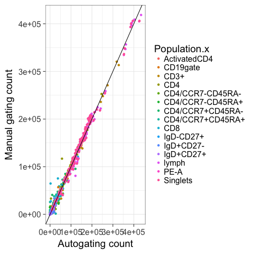
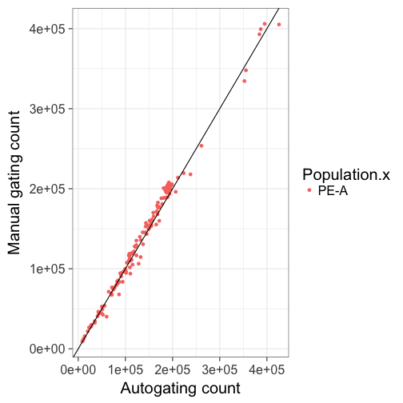
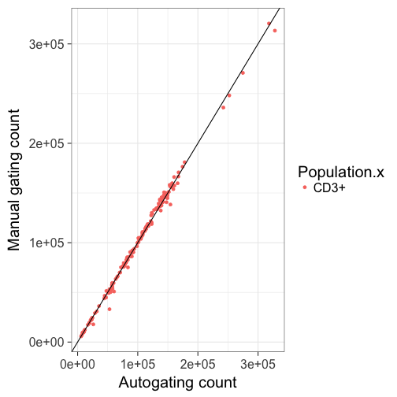
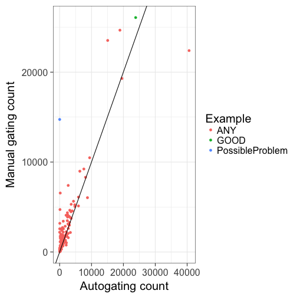

Auto gating update
========================================================
author: 
date: 
autosize: true

April 11th, 2017

OpenCyto
========================================================
[Finak, Frelinger, Jiang, et al. (2014)](https://doi.org/10.1371%2Fjournal.pcbi.1003806)
- Mimics manual gating by focusing on 2 channels at a time
  - can follow traditional gate hierarchy
  - e.g. gate lymph, then single, then live, etc
- Pipeline templates defined in .csv file
  - defines algorithmic approach for each gate to be applied across many samples
  - not "just push go", takes some setup for a decent template
- Results are interpretable and labelled populations 
  - not geared toward detecting novel cell types

OpenCyto
========================================================

> The two top performing gating algorithms - OpenCyto (v. 1.7.4), flowDensity (v. 1.4.0) - in a study run by the FlowCAP consortium aimed at selecting the best performing algorithms for this larger study were chosen for the analysis presented in this paper. ***Standardizing Flow Cytometry Immunophenotyping Analysis from the Human ImmunoPhenotyping Consortium*** [Finak, Langweiler, Jaimes, et al. (2016)](https://doi.org/10.1038%2Fsrep20686)

- Stole template from above as a start
  - our panel 1 template currently lives [here](https://github.com/PankratzLab/auto-fcs/blob/master/explore/openCyto/lymph.dev.b.csv)
  
Current progres overview 
========================================================
class: esmall-table

| N_SAMPS| N_DATA|    RHO|  BETA| BETA_SE|     R2|  ICC_1|
|-------:|------:|------:|-----:|-------:|------:|------:|
|     150|   2250| 0.9887| 1.016|  0.0014| 0.9956| 0.9976|
***

| N_SAMPS| N_DATA|    RHO|   BETA| BETA_SE|     R2|  ICC_1|
|-------:|------:|------:|------:|-------:|------:|------:|
|     150|   2250| 0.9856| 0.9914|  0.0025| 0.9864| 0.9931|

Lymphocytes (SSC-A v FSC-A)
========================================================
class: esmall-table

| N_SAMPS| N_DATA|    RHO|  BETA| BETA_SE|     R2| ICC_1|
|-------:|------:|------:|-----:|-------:|------:|-----:|
|     150|    150| 0.9878| 1.011|  0.0081| 0.9905| 0.995|
***

| N_SAMPS| N_DATA|   RHO|  BETA| BETA_SE|     R2|  ICC_1|
|-------:|------:|-----:|-----:|-------:|------:|------:|
|     150|    150| 0.997| 1.037|   0.005| 0.9966| 0.9972|

Single Cells (FSC-H v FSC-W)
========================================================
class: esmall-table

| N_SAMPS| N_DATA|    RHO|  BETA| BETA_SE|     R2|  ICC_1|
|-------:|------:|------:|-----:|-------:|------:|------:|
|     150|    150| 0.9822| 1.016|  0.0087| 0.9893| 0.9934|
***

| N_SAMPS| N_DATA|    RHO|   BETA| BETA_SE|     R2|   ICC_1|
|-------:|------:|------:|------:|-------:|------:|-------:|
|     150|    150| 0.0476| 0.0302|   0.022| 0.0125| -0.0274|

Live cells (PE-)
========================================================
class: esmall-table

| N_SAMPS| N_DATA|    RHO|  BETA| BETA_SE|     R2|  ICC_1|
|-------:|------:|------:|-----:|-------:|------:|------:|
|     150|    150| 0.9822| 1.016|  0.0088| 0.9891| 0.9932|
***

| N_SAMPS| N_DATA|   RHO|  BETA| BETA_SE|     R2|  ICC_1|
|-------:|------:|-----:|-----:|-------:|------:|------:|
|     150|    150| 0.668| 1.129|  0.0962| 0.4822| 0.6212|

Tcells (CD3+ CD19-)
========================================================
class: esmall-table

| N_SAMPS| N_DATA|    RHO|   BETA| BETA_SE|     R2|  ICC_1|
|-------:|------:|------:|------:|-------:|------:|------:|
|     150|    150| 0.9959| 0.9959|  0.0054| 0.9956| 0.9978|
***

| N_SAMPS| N_DATA|    RHO|   BETA| BETA_SE|     R2|  ICC_1|
|-------:|------:|------:|------:|-------:|------:|------:|
|     150|    150| 0.9782| 0.9069|  0.0134| 0.9689| 0.9711|

Helper Tcells-CD4+
========================================================
class: esmall-table

| N_SAMPS| N_DATA|    RHO|  BETA| BETA_SE|     R2|  ICC_1|
|-------:|------:|------:|-----:|-------:|------:|------:|
|     150|    150| 0.9986| 1.002|  0.0041| 0.9975| 0.9987|
***

| N_SAMPS| N_DATA|    RHO|   BETA| BETA_SE|     R2| ICC_1|
|-------:|------:|------:|------:|-------:|------:|-----:|
|     150|    150| 0.9936| 0.9649|  0.0128| 0.9747| 0.987|

central memory helper Tcells (CCR7+ CD45RA-)
========================================================
class: esmall-table

| N_SAMPS| N_DATA|    RHO|   BETA| BETA_SE|     R2|  ICC_1|
|-------:|------:|------:|------:|-------:|------:|------:|
|     150|    150| 0.9819| 0.9271|  0.0204| 0.9331| 0.9654|
***

| N_SAMPS| N_DATA|    RHO|   BETA| BETA_SE|     R2|  ICC_1|
|-------:|------:|------:|------:|-------:|------:|------:|
|     150|    150| 0.9245| 0.8431|  0.0295| 0.8469| 0.9167|

effector helper Tcells (CCR7- CD45RA+)
========================================================
class: esmall-table

| N_SAMPS| N_DATA|    RHO|   BETA| BETA_SE|     R2|  ICC_1|
|-------:|------:|------:|------:|-------:|------:|------:|
|     150|    150| 0.8069| 0.8249|  0.0382| 0.7593| 0.8659|
***

| N_SAMPS| N_DATA|    RHO|   BETA| BETA_SE|     R2|  ICC_1|
|-------:|------:|------:|------:|-------:|------:|------:|
|     150|    150| 0.7623| 0.8235|  0.0691| 0.4898| 0.6756|

effector memory helper Tcells (CCR7- CD45RA-)
========================================================
class: esmall-table

| N_SAMPS| N_DATA|    RHO|  BETA| BETA_SE|     R2|  ICC_1|
|-------:|------:|------:|-----:|-------:|------:|------:|
|     150|    150| 0.9082| 0.794|  0.0294| 0.8312| 0.8859|
***

| N_SAMPS| N_DATA|    RHO|   BETA| BETA_SE|     R2|  ICC_1|
|-------:|------:|------:|------:|-------:|------:|------:|
|     150|    150| 0.8364| 0.7374|  0.0303| 0.8005| 0.8585|

naive helper Tcells (CCR7+ CD45RA+)
========================================================
class: esmall-table

| N_SAMPS| N_DATA|    RHO|   BETA| BETA_SE|    R2|  ICC_1|
|-------:|------:|------:|------:|-------:|-----:|------:|
|     150|    150| 0.9809| 0.9679|  0.0108| 0.982| 0.9895|
***

| N_SAMPS| N_DATA|    RHO|   BETA| BETA_SE|    R2|  ICC_1|
|-------:|------:|------:|------:|-------:|-----:|------:|
|     150|    150| 0.9901| 0.8788|  0.0123| 0.972| 0.9745|

cytotoxic Tcells-CD8+
========================================================
class: esmall-table

| N_SAMPS| N_DATA|    RHO|   BETA| BETA_SE|     R2|  ICC_1|
|-------:|------:|------:|------:|-------:|------:|------:|
|     150|    150| 0.9868| 0.9619|  0.0191| 0.9447| 0.9716|
***

| N_SAMPS| N_DATA|    RHO|   BETA| BETA_SE|     R2|  ICC_1|
|-------:|------:|------:|------:|-------:|------:|------:|
|     150|    150| 0.9688| 0.9802|  0.0227| 0.9262| 0.9609|

B cells (CD3- CD19+) 
========================================================
class: esmall-table

| N_SAMPS| N_DATA|    RHO|  BETA| BETA_SE|     R2|  ICC_1|
|-------:|------:|------:|-----:|-------:|------:|------:|
|     150|    150| 0.9342| 0.923|  0.0304| 0.8617| 0.9233|
***

| N_SAMPS| N_DATA|    RHO|  BETA| BETA_SE|     R2|  ICC_1|
|-------:|------:|------:|-----:|-------:|------:|------:|
|     150|    150| 0.8826| 1.002|  0.0429| 0.7867| 0.8718|

Summary
========================================================

- OpenCyto seems to work
- Lots of room for improvement
- Iterative process

ICC
========================================================

From [Wikipedia](https://en.wikipedia.org/wiki/Intraclass_correlation)

[Cicchetti (1994)](https://doi.org/10.1037%2F1040-3590.6.4.284) gives the following often quoted guidelines for interpretation for kappa or ICC inter-rater agreement measures:

- Less than 0.40—poor.
- Between 0.40 and 0.59—Fair.
- Between 0.60 and 0.74—Good.
- Between 0.75 and 1.00—Excellent.

