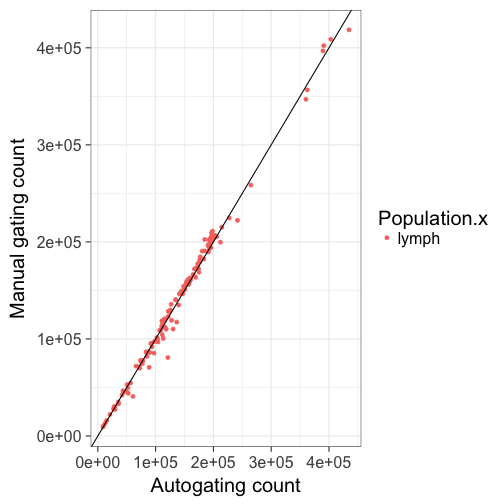
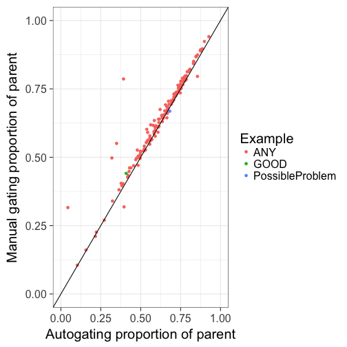
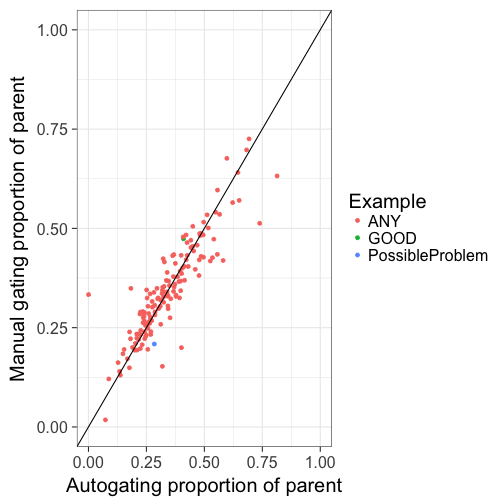

Auto gating update
========================================================
author: 
date: 
autosize: true

April 11th, 2017

OpenCyto
========================================================
[Finak, Frelinger, Jiang, et al. (2014)](https://doi.org/10.1371%2Fjournal.pcbi.1003806)
- Mimics manual gating by focusing on 2 channels at a time
  - can follow traditional gate hierarchy
  - e.g. gate lymph, then single, then live, etc
- Pipeline templates defined in .csv file
  - defines algorithmic approach for each gate to be applied across many samples
  - not "just push go", takes some setup for a decent template
- Results are interpretable and labelled populations 
  - not geared toward detecting novel cell types

OpenCyto
========================================================

> The two top performing gating algorithms - OpenCyto (v. 1.7.4), flowDensity (v. 1.4.0) - in a study run by the FlowCAP consortium aimed at selecting the best performing algorithms for this larger study were chosen for the analysis presented in this paper. ***Standardizing Flow Cytometry Immunophenotyping Analysis from the Human ImmunoPhenotyping Consortium*** [Finak, Langweiler, Jaimes, et al. (2016)](https://doi.org/10.1038%2Fsrep20686)

- Stole template from above as a start
  - our panel 1 template currently lives [here](https://github.com/PankratzLab/auto-fcs/blob/master/explore/openCyto/lymph.dev.b.csv)
  
Current progres overview 
========================================================
class: esmall-table

| N_SAMPS| N_DATA|    RHO|  BETA| BETA_SE|     R2|  ICC_1|
|-------:|------:|------:|-----:|-------:|------:|------:|
|     151|   2265| 0.9867| 1.015|  0.0014| 0.9956| 0.9977|
***

| N_SAMPS| N_DATA|    RHO|   BETA| BETA_SE|     R2|  ICC_1|
|-------:|------:|------:|------:|-------:|------:|------:|
|     151|   2265| 0.9811| 0.9879|  0.0029| 0.9809| 0.9903|

Lymphocytes (SSC-A v FSC-A)
========================================================
class: esmall-table

| N_SAMPS| N_DATA|    RHO|  BETA| BETA_SE|     R2|  ICC_1|
|-------:|------:|------:|-----:|-------:|------:|------:|
|     151|    151| 0.9883| 1.014|  0.0078| 0.9913| 0.9954|
***

| N_SAMPS| N_DATA|    RHO|  BETA| BETA_SE|     R2|  ICC_1|
|-------:|------:|------:|-----:|-------:|------:|------:|
|     151|    151| 0.9969| 1.038|   0.005| 0.9966| 0.9972|

Single Cells (FSC-H v FSC-W)
========================================================
class: esmall-table

| N_SAMPS| N_DATA|    RHO|  BETA| BETA_SE|     R2|  ICC_1|
|-------:|------:|------:|-----:|-------:|------:|------:|
|     151|    151| 0.9824| 1.018|  0.0087| 0.9893| 0.9935|
***

| N_SAMPS| N_DATA|    RHO|   BETA| BETA_SE|     R2|   ICC_1|
|-------:|------:|------:|------:|-------:|------:|-------:|
|     151|    151| 0.0546| 0.0321|  0.0225| 0.0134| -0.0297|

Live cells (PE-)
========================================================
class: esmall-table

| N_SAMPS| N_DATA|    RHO|  BETA| BETA_SE|    R2|  ICC_1|
|-------:|------:|------:|-----:|-------:|-----:|------:|
|     151|    151| 0.9822| 1.019|  0.0088| 0.989| 0.9933|
***

| N_SAMPS| N_DATA|   RHO|  BETA| BETA_SE|     R2|  ICC_1|
|-------:|------:|-----:|-----:|-------:|------:|------:|
|     151|    151| 0.679| 1.073|  0.0936| 0.4687| 0.6221|

Tcells (CD3+ CD19-)
========================================================
class: esmall-table

| N_SAMPS| N_DATA|    RHO|  BETA| BETA_SE|     R2|  ICC_1|
|-------:|------:|------:|-----:|-------:|------:|------:|
|     151|    151| 0.9958| 0.998|  0.0054| 0.9957| 0.9978|
***

| N_SAMPS| N_DATA|    RHO|   BETA| BETA_SE|     R2|  ICC_1|
|-------:|------:|------:|------:|-------:|------:|------:|
|     151|    151| 0.9781| 0.9063|  0.0135| 0.9682| 0.9709|

Helper Tcells-CD4+
========================================================
class: esmall-table

| N_SAMPS| N_DATA|    RHO|  BETA| BETA_SE|     R2|  ICC_1|
|-------:|------:|------:|-----:|-------:|------:|------:|
|     151|    151| 0.9987| 1.004|   0.004| 0.9977| 0.9988|
***

| N_SAMPS| N_DATA|    RHO|   BETA| BETA_SE|     R2|  ICC_1|
|-------:|------:|------:|------:|-------:|------:|------:|
|     151|    151| 0.9933| 0.9647|  0.0128| 0.9744| 0.9868|

central memory helper Tcells (CCR7+ CD45RA-)
========================================================
class: esmall-table

| N_SAMPS| N_DATA|  RHO|   BETA| BETA_SE|     R2|  ICC_1|
|-------:|------:|----:|------:|-------:|------:|------:|
|     151|    151| 0.98| 0.9237|  0.0204| 0.9323| 0.9649|
***

| N_SAMPS| N_DATA|    RHO|   BETA| BETA_SE|     R2|  ICC_1|
|-------:|------:|------:|------:|-------:|------:|------:|
|     151|    151| 0.9154| 0.8088|  0.0318| 0.8131| 0.8969|

effector helper Tcells (CCR7- CD45RA+)
========================================================
class: esmall-table

| N_SAMPS| N_DATA|    RHO|   BETA| BETA_SE|     R2|  ICC_1|
|-------:|------:|------:|------:|-------:|------:|------:|
|     151|    151| 0.7922| 0.8244|  0.0381| 0.7587| 0.8653|
***

| N_SAMPS| N_DATA|    RHO|   BETA| BETA_SE|     R2|  ICC_1|
|-------:|------:|------:|------:|-------:|------:|------:|
|     151|    151| 0.7467| 0.8182|  0.0695| 0.4816| 0.6677|

effector memory helper Tcells (CCR7- CD45RA-)
========================================================
class: esmall-table

| N_SAMPS| N_DATA|    RHO|   BETA| BETA_SE|     R2|  ICC_1|
|-------:|------:|------:|------:|-------:|------:|------:|
|     151|    151| 0.8791| 0.7816|  0.0312| 0.8082| 0.8757|
***

| N_SAMPS| N_DATA|    RHO|   BETA| BETA_SE|     R2|  ICC_1|
|-------:|------:|------:|------:|-------:|------:|------:|
|     151|    151| 0.8012| 0.7023|  0.0402| 0.6721| 0.7977|

naive helper Tcells (CCR7+ CD45RA+)
========================================================
class: esmall-table

| N_SAMPS| N_DATA|    RHO|   BETA| BETA_SE|     R2|  ICC_1|
|-------:|------:|------:|------:|-------:|------:|------:|
|     151|    151| 0.9711| 0.9695|  0.0129| 0.9743| 0.9861|
***

| N_SAMPS| N_DATA|    RHO|   BETA| BETA_SE|     R2|  ICC_1|
|-------:|------:|------:|------:|-------:|------:|------:|
|     151|    151| 0.9516| 0.7982|  0.0315| 0.8119| 0.8931|

cytotoxic Tcells-CD8+
========================================================
class: esmall-table

| N_SAMPS| N_DATA|    RHO|   BETA| BETA_SE|    R2|  ICC_1|
|-------:|------:|------:|------:|-------:|-----:|------:|
|     151|    151| 0.9866| 0.9615|  0.0192| 0.944| 0.9712|
***

| N_SAMPS| N_DATA|    RHO|   BETA| BETA_SE|     R2|  ICC_1|
|-------:|------:|------:|------:|-------:|------:|------:|
|     151|    151| 0.9688| 0.9794|  0.0226| 0.9268| 0.9612|

B cells (CD3- CD19+) 
========================================================
class: esmall-table

| N_SAMPS| N_DATA|    RHO|   BETA| BETA_SE|     R2|  ICC_1|
|-------:|------:|------:|------:|-------:|------:|------:|
|     151|    151| 0.9379| 0.9252|  0.0296| 0.8676| 0.9261|
***

| N_SAMPS| N_DATA|    RHO|  BETA| BETA_SE|     R2|  ICC_1|
|-------:|------:|------:|-----:|-------:|------:|------:|
|     151|    151| 0.8811| 1.002|  0.0429| 0.7858| 0.8715|

Summary
========================================================

- OpenCyto seems to work
- Lots of room for improvement
- Iterative process

ICC
========================================================

From [Wikipedia](https://en.wikipedia.org/wiki/Intraclass_correlation)

[Cicchetti (1994)](https://doi.org/10.1037%2F1040-3590.6.4.284) gives the following often quoted guidelines for interpretation for kappa or ICC inter-rater agreement measures:

- Less than 0.40—poor.
- Between 0.40 and 0.59—Fair.
- Between 0.60 and 0.74—Good.
- Between 0.75 and 1.00—Excellent.

