

Auto gating update
========================================================
author: 
date: 
autosize: true

April 11th, 2017

OpenCyto
========================================================
[Finak, Frelinger, Jiang, et al. (2014)](https://doi.org/10.1371%2Fjournal.pcbi.1003806)
- Mimics manual gating by focusing on 2 channels at a time
  - can follow traditional gate hierarchy
  - e.g. gate lymph, then single, then live, etc
- Pipeline templates defined in .csv file
  - defines algorithmic approach for each gate to be applied across many samples
  - not "just push go", takes some setup for a decent template
- Results are interpretable and labelled populations 
  - not geared toward detecting novel cell types

OpenCyto
========================================================

> The two top performing gating algorithms - OpenCyto (v. 1.7.4), flowDensity (v. 1.4.0) - in a study run by the FlowCAP consortium aimed at selecting the best performing algorithms for this larger study were chosen for the analysis presented in this paper. ***Standardizing Flow Cytometry Immunophenotyping Analysis from the Human ImmunoPhenotyping Consortium*** [Finak, Langweiler, Jaimes, et al. (2016)](https://doi.org/10.1038%2Fsrep20686)

- Stole template from above as a start
  - our panel 1 template currently lives [here](https://github.com/PankratzLab/auto-fcs/blob/master/explore/openCyto/lymph.dev.b.csv)
  
Current progress overview 
========================================================
class: esmall-table

| N_SAMPS| N_DATA|    RHO|  BETA| BETA_SE|     R2|  ICC_1|
|-------:|------:|------:|-----:|-------:|------:|------:|
|     151|   2265| 0.9846| 1.015|  0.0015| 0.9949| 0.9972|
***

| N_SAMPS| N_DATA|   RHO|   BETA| BETA_SE|     R2| ICC_1|
|-------:|------:|-----:|------:|-------:|------:|-----:|
|     151|   2265| 0.979| 0.9861|  0.0031| 0.9782| 0.989|

Example OpenCyto gates
========================================================
class: esmall-table

***
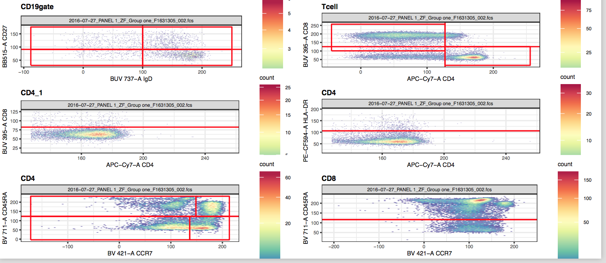

Next few slides
========================================================
class: esmall-table

- For each gate
  - a good-ish example of an auto gate
  - a bad example/common problems
  - overview of gate performance
 
Lymphocytes (SSC-A v FSC-A)
========================================================
class: esmall-table

|     |   FN|     TN|    TP| FP|    ACC|   SENS| SPEC| PREC|
|:----|----:|------:|-----:|--:|------:|------:|----:|----:|
|Freq | 1490| 142572| 28420|  0| 0.9914| 0.9502|    1|    1|
***

|     |   FN|    FP|     TN|    TP|    ACC|   SENS|   SPEC|   PREC|
|:----|----:|-----:|------:|-----:|------:|------:|------:|------:|
|Freq | 2849| 22579| 778949| 38211| 0.9698| 0.9306| 0.9718| 0.6286|

- may decrease the quantile of lymph cluster from 95% back to 90%

Lymphocytes (SSC-A v FSC-A)
========================================================
class: esmall-table

| N_SAMPS| N_DATA|    RHO|  BETA| BETA_SE|     R2|  ICC_1|
|-------:|------:|------:|-----:|-------:|------:|------:|
|     151|    151| 0.9885| 1.014|  0.0078| 0.9912| 0.9953|
***

| N_SAMPS| N_DATA|    RHO|  BETA| BETA_SE|     R2|  ICC_1|
|-------:|------:|------:|-----:|-------:|------:|------:|
|     151|    151| 0.9968| 1.038|   0.005| 0.9966| 0.9972|

Single Cells (FSC-H v FSC-W)
========================================================
class: esmall-table

|     |  FN|    FP|      TN|    TP|    ACC|   SENS|   SPEC|   PREC|
|:----|---:|-----:|-------:|-----:|------:|------:|------:|------:|
|Freq | 224| 10743| 1096246| 84062| 0.9908| 0.9973| 0.9903| 0.8867|

***

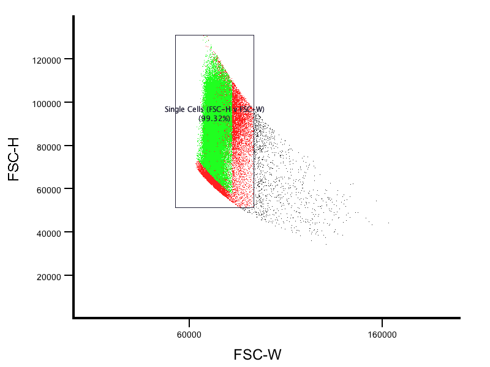

|     |    FN| FP|      TN|     TP|    ACC|   SENS| SPEC|   PREC|
|:----|-----:|--:|-------:|------:|------:|------:|----:|------:|
|Freq | 10397| 46| 1237576| 143142| 0.9925| 0.9323|    1| 0.9997|

- Force FSC-W+ to have a minimum cutoff or make more inclusive ? What is the manual strategy?

Single Cells (FSC-H v FSC-W)
========================================================
class: esmall-table

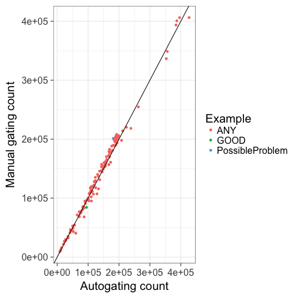

| N_SAMPS| N_DATA|    RHO|  BETA| BETA_SE|     R2|  ICC_1|
|-------:|------:|------:|-----:|-------:|------:|------:|
|     151|    151| 0.9822| 1.018|  0.0087| 0.9892| 0.9935|
***

| N_SAMPS| N_DATA|    RHO|  BETA| BETA_SE|     R2|   ICC_1|
|-------:|------:|------:|-----:|-------:|------:|-------:|
|     151|    151| 0.0585| 0.032|  0.0225| 0.0134| -0.0278|

Live cells (PE-)
========================================================
class: esmall-table

|     |  FN|    FP|      TN|    TP|    ACC|   SENS|   SPEC|   PREC|
|:----|---:|-----:|-------:|-----:|------:|------:|------:|------:|
|Freq | 213| 10668| 1096940| 83454| 0.9909| 0.9975| 0.9904| 0.8867|

***

|     |    FN|   FP|     TN|     TP|   ACC|   SENS|   SPEC|   PREC|
|:----|-----:|----:|------:|------:|-----:|------:|------:|------:|
|Freq | 17050| 7378| 476522| 178534| 0.964| 0.9128| 0.9848| 0.9603|

- victim of singlet gate

Live cells (PE-)
========================================================
class: esmall-table

| N_SAMPS| N_DATA|    RHO|  BETA| BETA_SE|     R2|  ICC_1|
|-------:|------:|------:|-----:|-------:|------:|------:|
|     151|    151| 0.9821| 1.019|  0.0088| 0.9889| 0.9933|
***

| N_SAMPS| N_DATA|    RHO|  BETA| BETA_SE|     R2|  ICC_1|
|-------:|------:|------:|-----:|-------:|------:|------:|
|     151|    151| 0.6801| 1.064|  0.0931| 0.4672| 0.6227|

Tcells (CD3+ CD19-)
========================================================
class: esmall-table

|     |   FN|  FP|      TN|     TP|    ACC|   SENS|   SPEC|  PREC|
|:----|----:|---:|-------:|------:|------:|------:|------:|-----:|
|Freq | 4244| 273| 1454088| 136130| 0.9972| 0.9698| 0.9998| 0.998|

***

|     |   FN|   FP|     TN|    TP|    ACC|   SENS|  SPEC|   PREC|
|:----|----:|----:|------:|-----:|------:|------:|-----:|------:|
|Freq | 1393| 3028| 603276| 43658| 0.9932| 0.9691| 0.995| 0.9351|
    
- can trim sides (and a bit less on left side)

Tcells (CD3+ CD19-)
========================================================
class: esmall-table

| N_SAMPS| N_DATA|    RHO|   BETA| BETA_SE|     R2|  ICC_1|
|-------:|------:|------:|------:|-------:|------:|------:|
|     151|    151| 0.9958| 0.9979|  0.0054| 0.9956| 0.9978|
***

| N_SAMPS| N_DATA|    RHO|   BETA| BETA_SE|     R2|  ICC_1|
|-------:|------:|------:|------:|-------:|------:|------:|
|     151|    151| 0.9784| 0.9059|  0.0133| 0.9687| 0.9711|

Helper Tcells-CD4+
========================================================
class: esmall-table

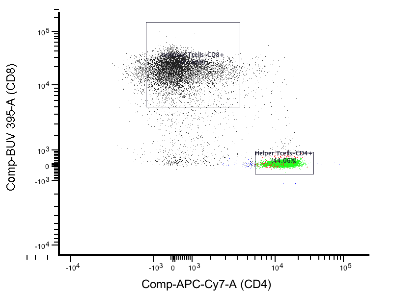

|     |  FN|  FP|     TN|   TP|    ACC|   SENS|   SPEC|   PREC|
|:----|---:|---:|------:|----:|------:|------:|------:|------:|
|Freq | 880| 104| 524259| 6874| 0.9982| 0.8865| 0.9998| 0.9851|

***

|     |   FN|   FP|     TN|    TP|    ACC|  SENS|   SPEC|   PREC|
|:----|----:|----:|------:|-----:|------:|-----:|------:|------:|
|Freq | 5807| 7577| 963616| 94294| 0.9875| 0.942| 0.9922| 0.9256|

Helper Tcells-CD4+
========================================================
class: esmall-table

| N_SAMPS| N_DATA|    RHO|  BETA| BETA_SE|    R2|  ICC_1|
|-------:|------:|------:|-----:|-------:|-----:|------:|
|     151|    151| 0.9891| 1.015|  0.0113| 0.982| 0.9897|
***

| N_SAMPS| N_DATA|    RHO|   BETA| BETA_SE|     R2|  ICC_1|
|-------:|------:|------:|------:|-------:|------:|------:|
|     151|    151| 0.9709| 0.9173|  0.0215| 0.9241| 0.9539|

central memory helper Tcells (CCR7+ CD45RA-)
========================================================
class: esmall-table

 

***

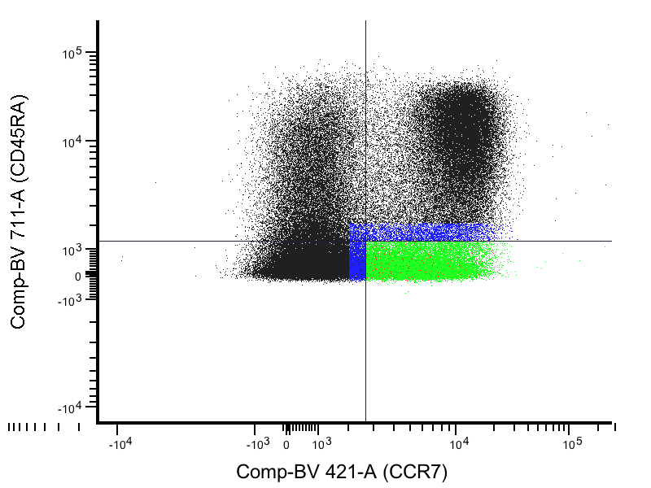

 

central memory helper Tcells (CCR7+ CD45RA-)
========================================================
class: esmall-table

| N_SAMPS| N_DATA|    RHO|   BETA| BETA_SE|     R2|  ICC_1|
|-------:|------:|------:|------:|-------:|------:|------:|
|     151|    151| 0.9643| 0.9344|  0.0238| 0.9121| 0.9542|
***
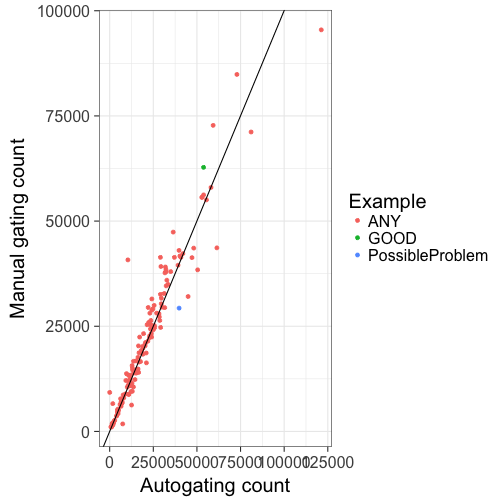

| N_SAMPS| N_DATA|   RHO|   BETA| BETA_SE|     R2|  ICC_1|
|-------:|------:|-----:|------:|-------:|------:|------:|
|     151|    151| 0.898| 0.7929|  0.0329| 0.7959| 0.8867|

effector helper Tcells (CCR7- CD45RA+)
========================================================
class: esmall-table

|     |   FN|   FP|      TN|    TP|    ACC|  SENS|   SPEC|   PREC|
|:----|----:|----:|-------:|-----:|------:|-----:|------:|------:|
|Freq | 3307| 1114| 2113444| 22741| 0.9979| 0.873| 0.9995| 0.9533|

***

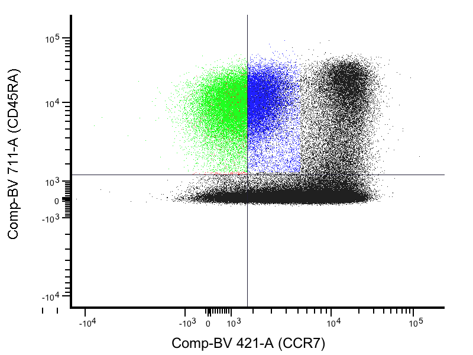

|     |  FN|    FP|     TN|    TP|    ACC|   SENS|   SPEC|   PREC|
|:----|---:|-----:|------:|-----:|------:|------:|------:|------:|
|Freq | 953| 19155| 786225| 21460| 0.9757| 0.9575| 0.9762| 0.5284|

effector helper Tcells (CCR7- CD45RA+)
========================================================
class: esmall-table

| N_SAMPS| N_DATA|    RHO|   BETA| BETA_SE|     R2|  ICC_1|
|-------:|------:|------:|------:|-------:|------:|------:|
|     151|    151| 0.7592| 0.8319|  0.0386| 0.7567| 0.8635|
***

| N_SAMPS| N_DATA|    RHO|   BETA| BETA_SE|   R2| ICC_1|
|-------:|------:|------:|------:|-------:|----:|-----:|
|     151|    151| 0.7198| 0.7991|  0.0695| 0.47| 0.661|

effector memory helper Tcells (CCR7- CD45RA-)
========================================================
class: esmall-table

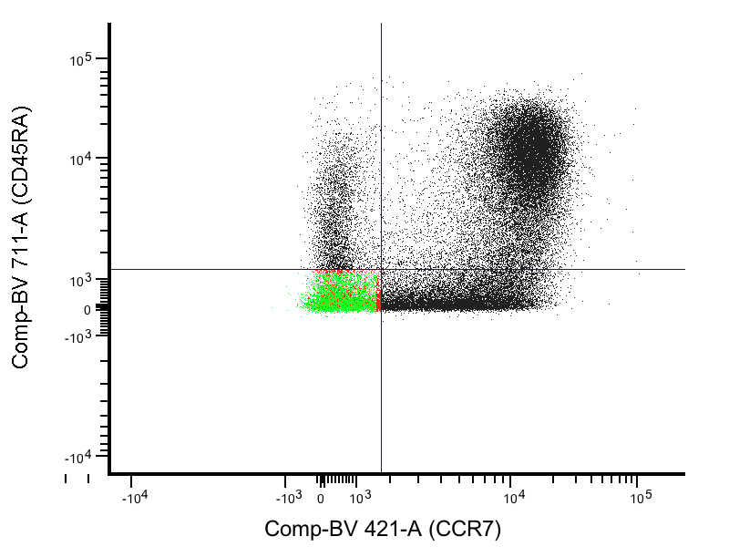

|     |   FN|  FP|      TN|   TP|    ACC|   SENS|   SPEC|  PREC|
|:----|----:|---:|-------:|----:|------:|------:|------:|-----:|
|Freq | 1509| 240| 1382591| 6821| 0.9987| 0.8188| 0.9998| 0.966|

***

|     |  FN|   FP|     TN|    TP|    ACC|   SENS|  SPEC|   PREC|
|:----|---:|----:|------:|-----:|------:|------:|-----:|------:|
|Freq | 974| 6718| 948445| 12272| 0.9921| 0.9265| 0.993| 0.6462|

effector memory helper Tcells (CCR7- CD45RA-)
========================================================
class: esmall-table

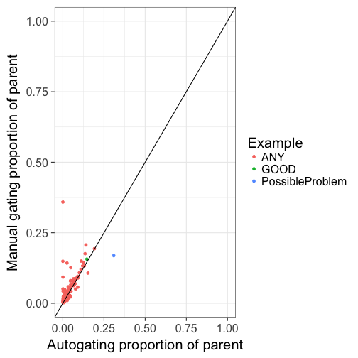

| N_SAMPS| N_DATA|    RHO|   BETA| BETA_SE|     R2|  ICC_1|
|-------:|------:|------:|------:|-------:|------:|------:|
|     151|    151| 0.8323| 0.7918|  0.0357| 0.7677| 0.8681|
***
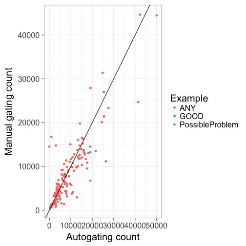

| N_SAMPS| N_DATA|    RHO|   BETA| BETA_SE|     R2|  ICC_1|
|-------:|------:|------:|------:|-------:|------:|------:|
|     151|    151| 0.7935| 0.7057|  0.0462| 0.6104| 0.7736|

naive helper Tcells (CCR7+ CD45RA+)
========================================================
class: esmall-table

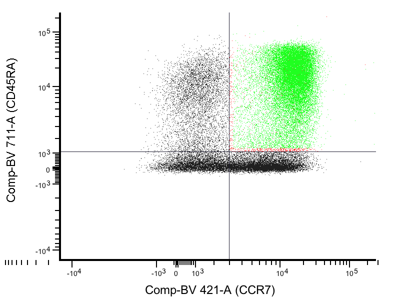

|     |  FN|  FP|     TN|    TP|    ACC|   SENS|   SPEC|  PREC|
|:----|---:|---:|------:|-----:|------:|------:|------:|-----:|
|Freq | 827| 244| 926060| 26892| 0.9989| 0.9702| 0.9997| 0.991|

***

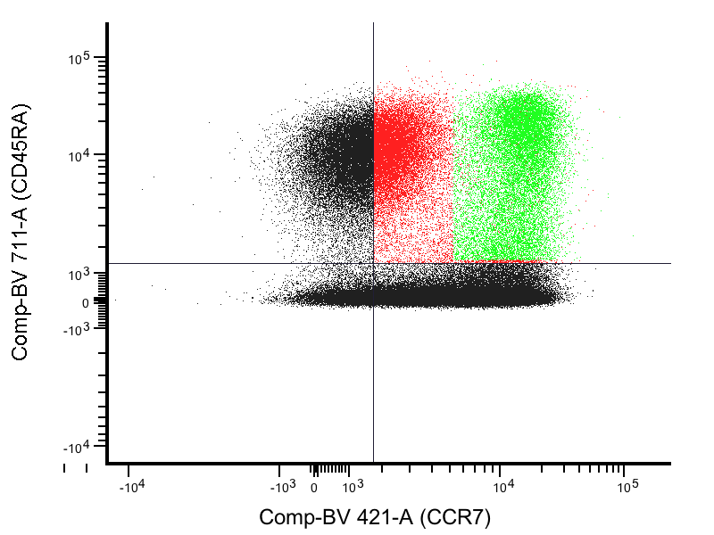

|     |    FN|  FP|     TN|    TP|    ACC|   SENS|   SPEC|   PREC|
|:----|-----:|---:|------:|-----:|------:|------:|------:|------:|
|Freq | 18678| 251| 789709| 19155| 0.9771| 0.5063| 0.9997| 0.9871|

naive helper Tcells (CCR7+ CD45RA+)
========================================================
class: esmall-table

| N_SAMPS| N_DATA|    RHO|   BETA| BETA_SE|     R2|  ICC_1|
|-------:|------:|------:|------:|-------:|------:|------:|
|     151|    151| 0.9714| 0.9777|  0.0133| 0.9733| 0.9853|
***
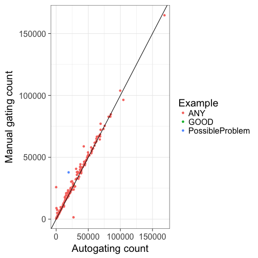

| N_SAMPS| N_DATA|    RHO|   BETA| BETA_SE|     R2| ICC_1|
|-------:|------:|------:|------:|-------:|------:|-----:|
|     151|    151| 0.9394| 0.7853|  0.0327| 0.7947| 0.885|

cytotoxic Tcells-CD8+
========================================================
class: esmall-table

|     |   FN|   FP|      TN|    TP|    ACC|   SENS|   SPEC|   PREC|
|:----|----:|----:|-------:|-----:|------:|------:|------:|------:|
|Freq | 2478| 2311| 1665944| 30763| 0.9972| 0.9255| 0.9986| 0.9301|

***

|     |   FN|   FP|     TN|    TP|    ACC|   SENS|   SPEC|   PREC|
|:----|----:|----:|------:|-----:|------:|------:|------:|------:|
|Freq | 2892| 5308| 926823| 33386| 0.9915| 0.9203| 0.9943| 0.8628|

cytotoxic Tcells-CD8+
========================================================
class: esmall-table

| N_SAMPS| N_DATA|    RHO|   BETA| BETA_SE|     R2|  ICC_1|
|-------:|------:|------:|------:|-------:|------:|------:|
|     151|    151| 0.9485| 0.9527|  0.0259| 0.9011| 0.9493|
***
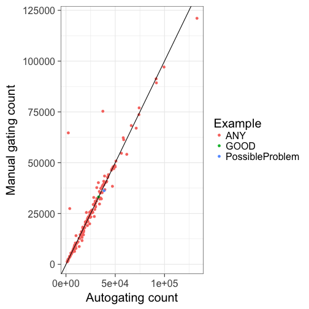

| N_SAMPS| N_DATA|    RHO|   BETA| BETA_SE|    R2|  ICC_1|
|-------:|------:|------:|------:|-------:|-----:|------:|
|     151|    151| 0.9343| 0.9315|  0.0324| 0.847| 0.9204|

B cells (CD3- CD19+)
========================================================
class: esmall-table

|     |  FN|  FP|     TN|    TP|    ACC|   SENS|  SPEC|   PREC|
|:----|---:|---:|------:|-----:|------:|------:|-----:|------:|
|Freq | 531| 895| 937430| 15167| 0.9985| 0.9662| 0.999| 0.9443|

***

|     |  FN|   FP|      TN|    TP|    ACC|   SENS|   SPEC|   PREC|
|:----|---:|----:|-------:|-----:|------:|------:|------:|------:|
|Freq | 521| 8506| 2738594| 23528| 0.9967| 0.9783| 0.9969| 0.7345|

- typically over- or under-calling the sneaky Bcells on CD19 dimension

B cells (CD3- CD19+) 
========================================================
class: esmall-table

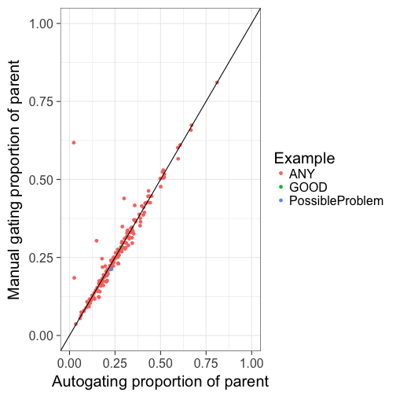

| N_SAMPS| N_DATA|    RHO|   BETA| BETA_SE|     R2|  ICC_1|
|-------:|------:|------:|------:|-------:|------:|------:|
|     151|    151| 0.9377| 0.9254|  0.0296| 0.8679| 0.9262|
***

| N_SAMPS| N_DATA|    RHO|  BETA| BETA_SE|     R2|  ICC_1|
|-------:|------:|------:|-----:|-------:|------:|------:|
|     151|    151| 0.8809| 1.002|  0.0428| 0.7857| 0.8714|

naive Bcells (CD27- IgD+)
========================================================
class: esmall-table

| N_SAMPS| N_DATA|   RHO|   BETA| BETA_SE|     R2|  ICC_1|
|-------:|------:|-----:|------:|-------:|------:|------:|
|     151|    151| 0.909| 0.8173|  0.0403| 0.7344| 0.8424|
***
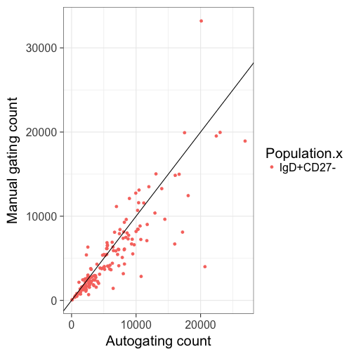

| N_SAMPS| N_DATA|    RHO|   BETA| BETA_SE|     R2| ICC_1|
|-------:|------:|------:|------:|-------:|------:|-----:|
|     151|    151| 0.9128| 0.8498|  0.0367| 0.7828| 0.868|

IgD- memory Bcells (CD27+)
========================================================
class: esmall-table

| N_SAMPS| N_DATA|   RHO| BETA| BETA_SE|     R2|  ICC_1|
|-------:|------:|-----:|----:|-------:|------:|------:|
|     151|    151| 0.823| 1.16|  0.0443| 0.8211| 0.8764|
***
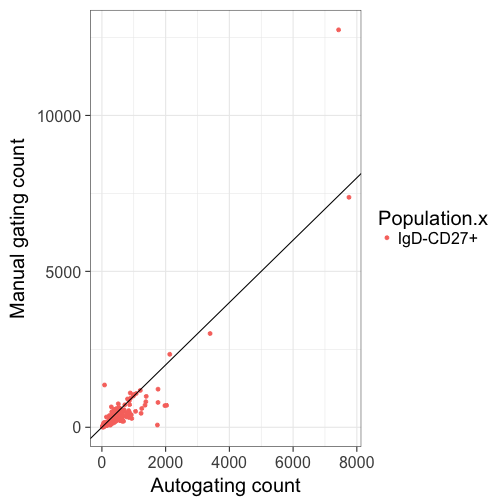

| N_SAMPS| N_DATA|    RHO|   BETA| BETA_SE|     R2|  ICC_1|
|-------:|------:|------:|------:|-------:|------:|------:|
|     151|    151| 0.8057| 0.4608|  0.0449| 0.4145| 0.5765|

IgD+ memory Bcells (CD27+)
========================================================
class: esmall-table

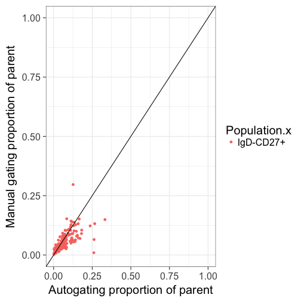

| N_SAMPS| N_DATA|    RHO|   BETA| BETA_SE|    R2| ICC_1|
|-------:|------:|------:|------:|-------:|-----:|-----:|
|     151|    151| 0.9212| 0.7128|  0.0113| 0.964| 0.925|
***
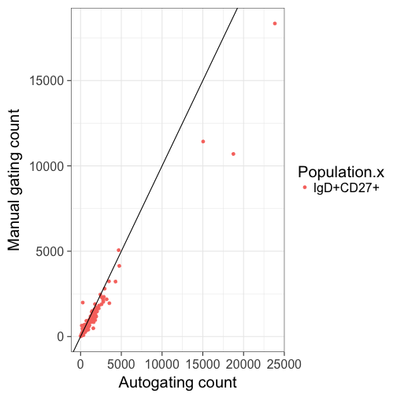

| N_SAMPS| N_DATA|    RHO|   BETA| BETA_SE|     R2|  ICC_1|
|-------:|------:|------:|------:|-------:|------:|------:|
|     151|    151| 0.8844| 0.7361|  0.0349| 0.7487| 0.8423|

OpenCyto Summary
========================================================

- Seems to work
- Lots of room for improvement
- Iterative process

 
Data QC ?
========================================================
Tested FlowAI
> ... consists of three key steps to check and remove suspected anomalies that derive from (i) abrupt changes in the flow rate, (ii) instability of signal acquisition and (iii) outliers in the lower limit and margin events in the upper limit of the dynamic range. ***flowAI: automatic and interactive anomaly discerning tools for flow cytometry data.*** [Monaco, Chen, Poidinger, et al. (2016)](https://doi.org/10.1093%2Fbioinformatics%2Fbtw191)

[Strange Flowrate Example](http://htmlpreview.github.io/?https://github.com/PankratzLab/auto-fcs/blob/master/explore/openCyto/QC/qcReview/2016-07-27_PANEL%201_ZF_Group%20one_F1632384_007_QC.html)

[Normal Flowrate Example](http://htmlpreview.github.io/?https://github.com/PankratzLab/auto-fcs/blob/master/explore/openCyto/QC/qcReview/2016-05-13_PANEL%201_ZF_panel%20one_F1632233_004_QC.html)

ICC
========================================================

From [Wikipedia](https://en.wikipedia.org/wiki/Intraclass_correlation)

[Cicchetti (1994)](https://doi.org/10.1037%2F1040-3590.6.4.284) gives the following often quoted guidelines for interpretation for kappa or ICC inter-rater agreement measures:

- Less than 0.40—poor.
- Between 0.40 and 0.59—Fair.
- Between 0.60 and 0.74—Good.
- Between 0.75 and 1.00—Excellent.

